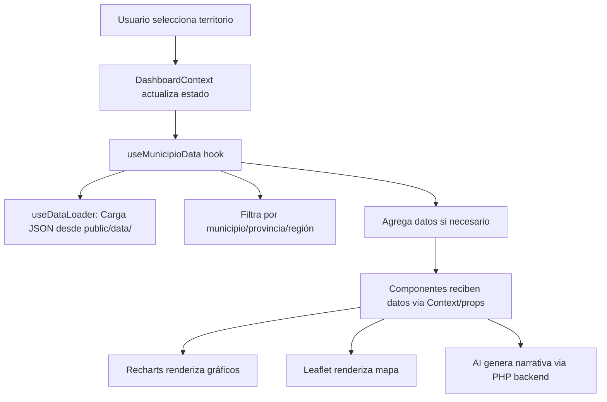

# Arquitectura del Proyecto

## Visión General

Tablero de diagnóstico territorial para la República Dominicana.
Aplicación web de una sola página (SPA) construida con React 18 + Vite.

```
┌─────────────────────────────────────────────────────────┐
│                    index.html                            │
│                    main.jsx (punto de entrada)           │
│                                                          │
│  ┌────────────────────────────────────────────────────┐  │
│  │  App.jsx (orquestación de layout)                 │  │
│  │  └─ DashboardProvider (estado global + datos)     │  │
│  │                                                     │  │
│  │  ┌──────────────┐  ┌───────────────────────────┐   │  │
│  │  │ context/     │  │ components/                │   │  │
│  │  │              │  │                            │   │  │
│  │  │ Dashboard    │→ │ TopSelectionAndMap         │   │  │
│  │  │ Context.jsx  │  │ PyramidsRow                │   │  │
│  │  │              │  │ DemografiaHogaresSection    │   │  │
│  │  │ (estado,     │  │ CondicionVidaSection        │   │  │
│  │  │  selección,  │  │ EducacionDashboard          │   │  │
│  │  │  handlers)   │  │ EconomyEmployment (charts/) │   │  │
│  │  │              │  │ SaludSection                │   │  │
│  │  └──────────────┘  │ ResumenComparacionSection   │   │  │
│  │                     │ ResumenNarrativoSection (AI)│   │  │
│  │  ┌──────────────┐  └───────────────────────────┘   │  │
│  │  │ hooks/       │                                   │  │
│  │  │ useDataLoader│  ┌───────────────────────────┐   │  │
│  │  │ useMunicipio │  │ charts/                    │   │  │
│  │  │ Data         │  │  PopulationCharts.jsx      │   │  │
│  │  └──────────────┘  │  HouseholdCharts.jsx       │   │  │
│  │                     │  EconomyCharts.jsx         │   │  │
│  │  ┌──────────────┐  │  SharedCharts.jsx          │   │  │
│  │  │ utils/       │  └───────────────────────────┘   │  │
│  │  │ dataHelpers  │                                   │  │
│  │  │ formatters   │  ┌───────────────────────────┐   │  │
│  │  │ calculations │  │ public/data/ (36 JSON)    │   │  │
│  │  │ educHelpers  │  │ + public/api/ (PHP)       │   │  │
│  │  │ resumenComp  │  └───────────────────────────┘   │  │
│  │  └──────────────┘                                   │  │
│  └────────────────────────────────────────────────────┘  │
└─────────────────────────────────────────────────────────┘
```

## Flujo de Datos



## Directorio `src/`

| Directorio/Archivo | Responsabilidad |
|---------------------|----------------|
| `App.jsx` | Componente raíz. Layout y composición de secciones |
| `main.jsx` | Punto de entrada de React |
| `index.css` | Estilos globales |
| `print.css` | Estilos para impresión/PDF |
| **context/** | |
| `context/DashboardContext.jsx` | Estado global: selección, datos, handlers. Elimina props drilling |
| **hooks/** | |
| `hooks/useDataLoader.js` | Carga de todos los archivos JSON (35+ archivos) |
| `hooks/useMunicipioData.js` | Hook principal: filtra y agrega datos por territorio seleccionado |
| **utils/** | |
| `utils/dataHelpers.js` | Funciones puras: normalizeAdm2, buildLongMap, buildProvinceMap, buildCondicionVidaParsed |
| `utils/educationHelpers.js` | Helpers para cálculos educativos |
| `utils/resumenComparacionHelpers.js` | Generación de filas para tabla de comparación |
| **components/** | |
| `components/TopSelectionAndMap.jsx` | Selector de territorio (región → provincia → municipio) + mapa |
| `components/RDMap.jsx` | Mapa interactivo con Leaflet |
| `components/PrintMapSVG.jsx` | Mapa estático SVG para impresión |
| `components/charts.jsx` | Re-export hub para todos los gráficos |
| `components/charts/PopulationCharts.jsx` | Indicadores básicos, pirámides, género, urbano/rural |
| `components/charts/HouseholdCharts.jsx` | Hogares totales, personas/hogar, tamaño |
| `components/charts/EconomyCharts.jsx` | Economía y empleo (DEE 2024) |
| `components/charts/SharedCharts.jsx` | Tarjetas temáticas genéricas |
| `components/PyramidsRow.jsx` | Pirámides de población 2022 vs 2010 |
| `components/DemografiaHogaresSection.jsx` | Sección de demografía y hogares |
| `components/CondicionVidaSection.jsx` | Condiciones de vida (agua, luz, TIC) |
| `components/EducacionDashboard.jsx` | Sección de educación |
| `components/SaludSection.jsx` | Sección de salud |
| `components/ResumenComparacionSection.jsx` | Tabla comparativa municipio vs provincia vs nacional |
| `components/ResumenNarrativoSection.jsx` | Resumen narrativo generado por IA (ChatGPT) |
| `components/ui/` | Componentes UI reutilizables (Card, etc.) |
| `data/adm2.json` | GeoJSON de municipios (bundled) |

## Directorio `public/`

| Directorio | Contenido |
|------------|-----------| 
| `public/data/` | 36 archivos JSON con datos territoriales (ver DATA_SOURCES.md) |
| `public/api/` | `generateNarrative.php` — Backend para generación de narrativa IA |

## Directorio `scripts/`

Scripts de utilidad para desarrollo (NO se ejecutan en producción):

| Script | Uso |
|--------|-----|
| `deploy.mjs` | Despliegue FTP al servidor de producción |
| `postbuild.mjs` | Post-procesamiento del build |
| `parse_*.js` | Parseo de PDFs del Censo/Anuarios para generar JSON |
| `verify_*.js` | Verificación de integridad de datos |

## Testing

| Herramienta | Uso |
|-------------|-----|
| Vitest | Unit testing framework |
| @testing-library/react | Testing de componentes React |
| jsdom | Entorno DOM para tests |

Ejecutar tests: `npm test` o `npx vitest run`

## Tecnologías

| Tecnología | Versión | Uso |
|------------|---------|-----|
| React | 18.x | Framework UI |
| Vite | 5.x | Build tool / dev server |
| Leaflet | 1.9.x | Mapas interactivos |
| Recharts | 2.6.x | Gráficos y visualizaciones |
| Tailwind CSS | 3.4.x | Estilos |
| Vitest | 4.x | Unit testing |
| OpenAI API | gpt-4o-mini | Narrativa automática (opcional) |
